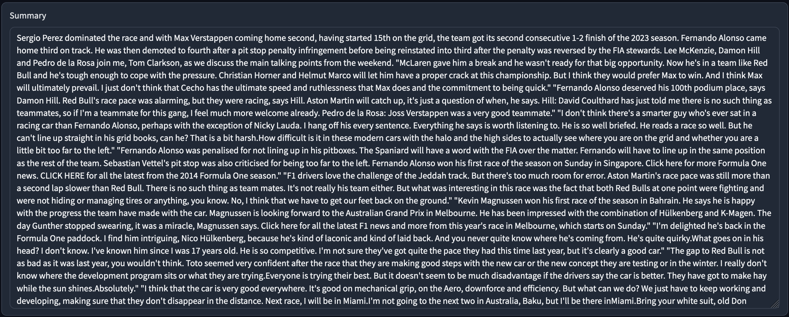

# Project 1: Podcast Summarizer
An application that automatically transcribes and summarizes a podcast, intended for use by journalists who get a significant portion of their news from those podcasts - specifically intended for RacingNews365, the largest Formula 1 news site in the Netherlands.

## Research Questions
Below are the research questions I adressed specifically with this project.  
- **How can I use generative AI to increase fan engagement?**  
While this tool isn't meant to be used by fans directly, it does benefit them in indirect ways. Using the summarizer, journalists can publish news faster, which means fans will be aware of what's happening sooner. Hopefully, the tool can also free up some of the journalists' time, allowing them to focus on creating more or higher quality content, improving the experience of fans using the site.  
- **What are the needs of TDE's various customers, and how can I fulfill those?**  
_Interviews:_ RacingNews365's office is located on the same floor as TDE, so I could easily communicate about their needs. The initial [requirements](/Project_1/Requirements.md) were formulated based on a meeting where they indicated their needs. I also plan to deliver the finished application to them, so they get a chance to use it and give feedback.  
There are also client leads at TDE who are aware of the needs of not only RacingNews365 but also other clients, who I could discuss implementation with.  
- **What different types of generative AI exist, and how can they be used in innovative new ways?**  
_Available product analysis / community research:_ A lot of research has already been done into this aspect of AI, so I'll have many tools I can use and build upon, many of which are open source. I had to determine which existing tools best suited my needs and how they could be implemented.  
_Prototyping:_ I set up a series of simple prototypes that I could use to test different models and compare them.

## Process Overview

### Exploration and Planning
From the start, I had a pretty clear view of my assignment, and what my end result would be used for. TDE had already discussed using tools like these with RacingNews365, and could tell me what the requirements were. I set up some [requirements](/Project_1/Requirements.md), made a first setup of the project plan, and started work.

### Research into Transcription Models
For this first project, I wanted to implement the AI models myself, to obtain a good base from which I could work the rest of the internship. To choose the right AI model for the job, I did some research into which were available, how difficult they were to work with, and their strenghts and weaknesses.

### Prototyping and Implementation
I quickly set up some simple prototypes that allowed me to play around with different transcription and summarization models, and get some experience with their implementation. These same prototypes were used to run some basic tests on the models, to pick the one that best suited my needs. Most of the development time of this project was spent on the backend, implementing the models and getting them to work together, as well as working on language options and a simple UI.

  
_Screenshot of the application_

I set up and ran a small demo to show the result of my work to TDE, both to show the other employees some of the possiblities for AI (especially implementing models of your own), as well as get some feedback on what could be improved for next project. In general, I think they were quite satisfied with the result, even if my way of working within the company could be improved (see reflection below)

I also met with one of the devops developers of TDE to discuss setting up a space on the TDE domain to host all of my finished demos.

### Future Steps and User Testing
I spent a lot of time working on the backend, and the frontend and UI of the project turned out pretty basic as a result. For my next project, I'd like to focus a bit more on making an accessible and usable application.

Unfortunately, I didn't have time to implement a feature for looking up timestamps in the podcast for certain parts of the summary. While I do have a good idea of how I could implement this, I ran out of time, and decided that this feature wasn't as important as getting the base application running well.

I want to offer the tool I created to RacingNews, and hopefully have them use it for a few weeks, after which I can hold some short interviews to get their throughts on it. It'll be interesting to see if they make use of it, and to hear their feedback.

In the weeks after I made the tool, it has seen some unexpected internal use within TDE - some of my colleagues needed to transcribe the voiceover for a video they were working on, and used the transcription aspect of the tool I made, saving a lot of time.

  
_First part of a summary of a Formula 1 podcast_

## Research Methods and Results
**Research Methods**  
- **How can I use generative AI to increase fan engagement?**  

- **What are the needs of TDE's various customers, and how can I fulfill those?**  
_Interviews:_ RacingNews365's office is located on the same floor as TDE, so I could easily communicate about their needs. The initial [requirements](/Project_1/Requirements.md) were formulated based on a meeting where they indicated their needs. I also plan to deliver the finished application to them, so they get a chance to use it and give feedback.  
There are also client leads at TDE who are aware of the needs of not only RacingNews365 but also other clients, who I could discuss implementation with.  
- **What different types of generative AI exist, and how can they be used in innovative new ways?**  
_Available product analysis / community research:_ A lot of research has already been done into this aspect of AI, so I'll have many tools I can use and build upon, many of which are open source. I had to determine which existing tools best suited my needs and how they could be implemented.  
_Prototyping:_ I set up a series of simple prototypes that I could use to test different models and compare them. The resulting Jupyter Notebooks can be found [here](https://github.com/RikJansenTU/PodcastSummarizer), and the results of the tests as well as the available product research can be found in this [research report](/Project_1/AI_Model_Research.md).

## Reflection and Feedback
Overall, setting up and making use of the AI models proved easier than expected, which allowed me to get going with prototyping and experimentation quite quickly. 

One thing I want to improve during the next project is my planning. While I did outline what I wanted to work on at the start of the assignment, I didn't make a very extensive or detailed list. For the next project, I want to plan out my activities more precisely, documenting exactly how long I think each activity will take. This will also make it easier for my coordinators, at both Fontys and TDE, to see what I'm working on.

Being more open about my work was a point of feedback I got from my TDE internship coordinator. When I get started on a project, I tend to dive in by myself, and I sometimes struggle letting other people know what I'm working on or asking for help. While I'm pretty happy with the technical end result of this first project, I think I can still take a lot of steps in how I act as part of TDE.
I think this struggle with involving others is partially due to the different work environment, suddenly being part of a larger team but without explicitly working on the same things. Starting next project, I want to take a more proactive approach in gathering feedback, asking for help, and showing off my work, for example by planning meetings with other team members to discuss my progress.
