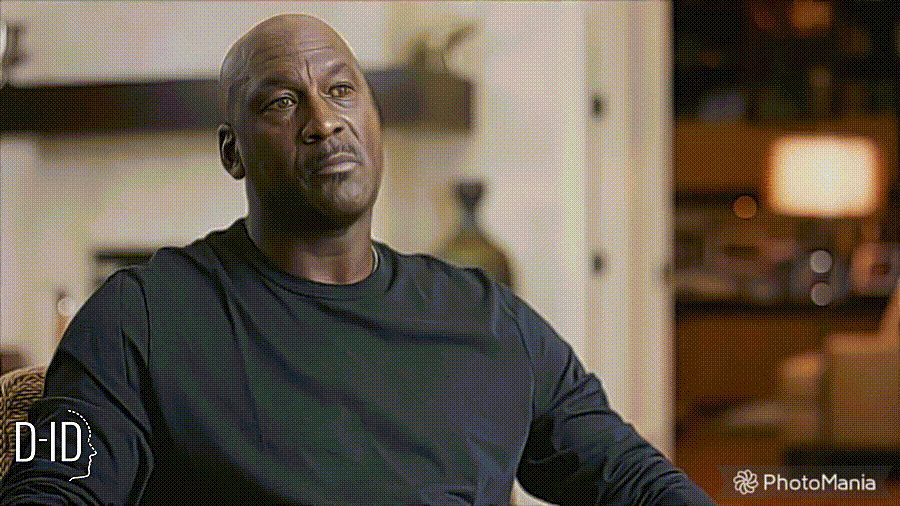
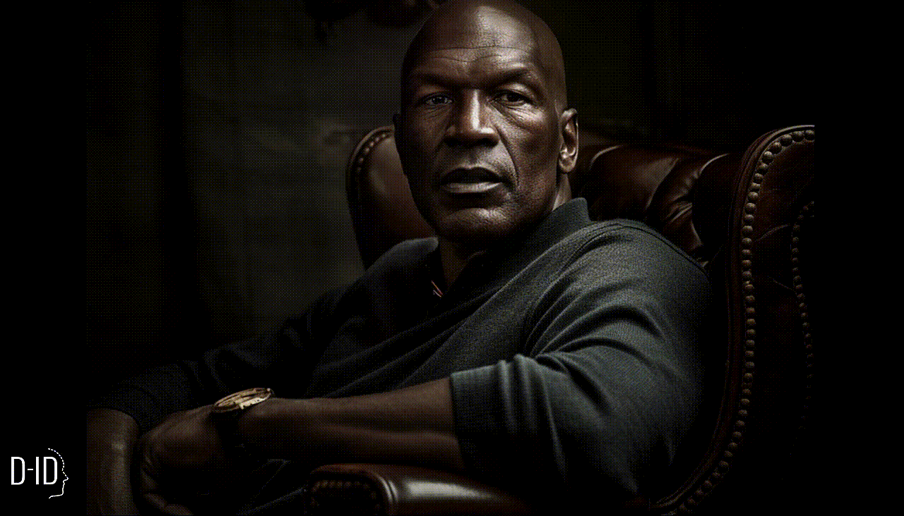

# Project 2: Sports Icons  
TDE will be hosting a Web3 showcase, where they are inviting several high-profile executives in the sports industry to present the opportunities that several new technologies offer. As a part of this conference, they would like to show off something impressive created by generative AI. In keeping with TDE's sports focus, I made a tool that generates video and audio of a famous athlete based on text input, for example allowing you to generate a video of Michael jordan welcoming guests to the conference.

## Research Questions
The following are the research questions I tried to answer with this project. The methods used, as well as the conclusions, can be found in the [research report](/Research_Report.md).
- **How can I use generative AI to increase fan engagement?**  
'Fan' is a bit of a narrower term in this context, not meaning a large group of supporters but a smaller group I'm trying to reach in a very personal manner - the potential clients in this case. The freedom that generative AI offers when it comes to its output allows you to create something impressive that's tailored to potentially a single person, which is what my tool is attempting to accomodate. Investigating what impact AI can have when used this way is an interesting angle from which to approach this research question.  
- **What different types of generative AI exist, and how can they be used in innovative new ways?**  
For this project, I wanted to make use of existing tools in order to investigate how useable and advanced they are, and be able to make a comparison between how easy this app is to build compared to the previous.  
- **What are the needs of TDE's various customers, and how can I fulfill those?**  
This tool is created for use by TDE themselves, so I needed to communicate and brainstorm with stakeholders within the company to ensure it met their needs.  
- **What ethical considerations have to be taken into account when working with generative AI?**  
There are some large ethical pitfalls surrounding this project, concerning privacy, free use, and misinformation, and I find it very important to examine those while working on this application.  

## Project Process

### Exploration and Planning  
I tried to involve the other TDE employees in the process from the get-go, setting up a meeting with them to discuss possibilities and opportunities for the project, as well as its scope. We discussed the end goal of what I would be making, and how we could best achieve that goal, as well as doing some initial brainstorming.

Since video generation is considerably more difficult than anything text-related, we decided that this project would make use of existing tools, combining several of those into a new application that met the needs of TDE. I also wanted to spend a bit more time on the UX this time, making something that's accessible and easy to use.

Based on feedback I got on the first project, I then tried to create a more extensive planning for this project, which can be found [here](Planning.md).

  
_Early attempt at generating Michael Jordan using Midjourney_

### First Research  
Much of my initial research was into the tools I wanted to make use of. I had to consider quality, usability (for example having an API), as well as cost. The voice generation was fairly easy: I quickly landed on [ElevenLabs](https://www.elevenlabs.io) because of its solid API, fast and high quality voice generation, and relatively low cost.

Video generation proved more difficult; while there are a variety of different tools available, many generate mediocre results. Of the highest quality ones, none that I could find allow you to generate video based on celebrities. After meeting with the stakeholders at TDE to present some options, we decided to generate the video based on an athlete's likeness created with [Midjourney](https://www.midjourney.com), an AI capable of generating lifelike images, currently the best in its category. 
This circuimvents the limitations as well as adding another layer of AI, which serves the projects goal of showing off the technology's capabilities.
For generating the talking head video based on the Midjourney image I decided to use [D-ID](https://www.d-id.com), because it netted the best results out of every tool I experimented with.

  
_An early experiment for generating video of Michael Jordan_

### Development  
I wanted to create a solid base for my application, which I could iteratively improve upon, as well as use to experiment with. I chose one athlete to focus on; Michael Jordan. If I could get the tool working for one person, it would be easy to add others. 

I started with the voice generation, which was fairly easy to get working, and I was quickly able to get great results. I also used this first prototype to start working on the UI, discussing potential changes with colleagues, which resulted in a more reactive and stripped down UI for the second prototype.

After that, I got started on the video aspect; this was more difficult, both due to the aforementioned restrictions placed on generating videos based on celebrities and the complexity of the API I was using. We experimented with generating portraits using Midjourney, getting as good of a likeness as possible, and used the best results to generate the video.

All that remained was to combine the audio and video generation, and make sure everything was functioning correctly. Some last-minute changes had to be made because one of the endpoints I was using stopped working, but I managed Considering the tool was supposed to be used by TDE, I wanted to make the code clean and easy to adjust, as well as facilitating the addition of more athletes in the future, even without my assistance. 

  
_Video generated using the final product_

## Results and Reflection  
The development of this project was quite different from that of the the previous one: it didn't present as much of a technical challenge because I was making use of APIs, so the focus was more on combining existing tools into something new, and creating an app that was easy to use and corresponded to TDE's brief. To achieve this, I gathered much more feedback, showing my progress several times a week, and discussing the direction I was going and what could be improved.

This helped me refine and improve my prototypes, and helped me come up with new approaches to the challenges I faced, for example the usage of Midjourney to circuimvent D-ID's filters. It also made the project more focused; instead of creating requirements beforehand and getting to work on my own, the more frequent discussion of my progress ensured I had a better idea of what TDE was looking for, and allowed me to make changes accordingly.

The more detailed planning I made also helped me stay organized and on track, and made sure I always knew what I was working on or had to get started with. I do think the way I set up the planning was a bit too restrictive: it would've been nice to have some space to account for unforseen delays, like when one of the API endpoints I was using suddenly stopped working and I had to rewrite part of my application.
For my next project I might use something like a Kanban board, to still be able to efficiently manage my tasks, but be a bit more flexible overall.

While I'm quite happy with my end result, I unfortunately didn't have much as much time as I would have liked to work on the frontend, for example giving the tool TDE colors and branding. I have scheduled some dedicated time to work on the frontend of all my finished applications towards the end of the internship, because I do think the way they look is important in their function as an AI showcase for TDE.

## Deliverables
Deliverables: The technologies I chose to use are detailed above, and the code making use of them can be found [here](https://github.com/RikJansenTU/SportIcons)  
usable app  
Deliverables: I wrote a [short report](Ethical_Considerations.md) on the ethical issues I see arising from applications like this one, as well as some reccommendations to safeguard against abuse.    
Frontend designs  
