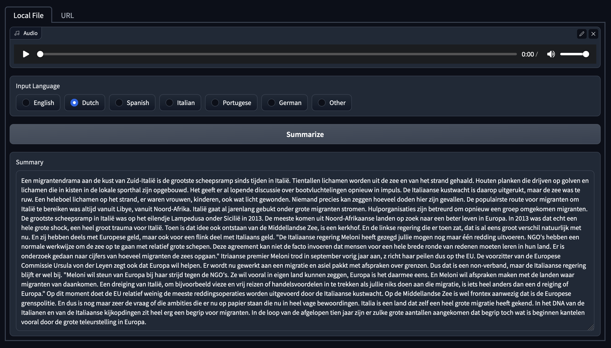

# TDE Internship Portfolio
Rik Jansen

Updated 19-4-23

# Table of Contents
- [The Internship](#the-internship)
- [Progress and Results - Overview](#progress-and-results---overview)
  * [First Weeks](#first-weeks)
  * [Project 1 - Podcast Summarizer](#project-1---podcast-summarizer)   
  * [Project 2 - Sport Icons](#project-2---sport-icons)
- [Final](#final)
- [Learning Outcomes](#learning-outcomes)

## The Internship
AI is playing an increasingly large role in society. New tools are rapidly being released to the public, quickly becoming more capable and sophisticated. Generative AI tools are now capable of creating art and music, writing code, function as personal assistants, or even build entire websites from scratch. For many industries, the technology is set to fundementally shake up the way things are done, for better or worse.  
Sooner or later, most companies will come into contact with generative AI, so investigating the potential applications and dangers early on can be a great boon in the long term. A company who makes full use of AI powered tools might in the near future be able to create high-quality products with lower costs and fewer staff, outperforming competitors, or offer products to customers that are completely unique.

**The Opportunity**  
Like I said above, generative AI has massive potential, and TDE is very interested in exploring the opportunities it offers. The company prides itself on being at the forefront of new technological advances, being able to offer their customers things that other marketing agencies can't. They [have worked with generative AI before](https://www.tde.nl/cases/the-masterpiece/), and see a lot of potential in its further use.  
This internship is a great opportunity for me to investigate the current state of generative AI, what it could be used for, and how it could serve TDE in the future. Even if the things I create don't get used directly, they can be used as a showcase to show (potential) customers what TDE is capable of. 
 
**The Goal**  
I want to explore the different uses of generative AI, preferably casting as wide a net as possible to be able to investigate the different ways TDE might make use of the technology. This could be a tool that the company uses internally to create things or increase productivity, or something that they use to sell their services to potential customers.
At the end of my internship, I will have showcased different applications of generative AI, and I'll be able to inform TDE on the best approaches to take when making use of the technology.

**Approach**    
To be able to investigate as many different AI-related subjects as possible I decided, along with my mentor at TDE, to split the internship into three different projects. This way, I can explore a few different themes, applications, and types of technology so I get a good general impression of the state of generative AI and how it can be used to serve TDE.  
Another advantage of setting up the internship this way is that it offers a certain amount of flexibility. Developments in the field of AI are incredibly rapid, which means it's very much possible that some new and groundbreaking piece of technology gets released halfway through the internship. Having a few different projects planned, the details of the later ones not yet set in stone, allows me a certain degree of flexibility to potentially make use of new AI developments.

**Research Questions**  
The following are the most important questions I want to answer over the course of the internship. The individual projects might have other, more specific, research questions attached; those will be listed in their respective chapters.  
- _How can I use generative AI to increase fan engagement?_  
This is the main research question I want to answer during my internship. Fan engagement is a broad concept in this context - it doesn't mean that everything I build will need to be used by sports fans directly, but it should serve them or improve their experience when interacting with TDE's products, which in turn will increase engagement.
- _What different types of generative AI exist, and how can they be used in innovative new ways?_  
Exploring the types of AI available, as well as their uses, will play an important part in achieving the internship's goals.
- _What are the needs of TDE's various customers, and how can I fulfill those?_  
If I can anticipate these customers' needs, and find a way to use AI to meet them, TDE will be able to proactively offer solutions, potentially earning them new clients or additional assignments.
- _Where does the passion of the sports fans that consume TDE's products lie, and how can I use AI to respond to those passions in a positive way?_  
The nice thing about a company that focuses on sports is that the end users tend to be very passionate about their engagement. This offers a unique opportunity to create something positive that these fans truly enjoy interacting with.
- _What ethical considerations have to be taken into account when working with generative AI?_  
AI will very likely have a massive impact on our society, enabling us to do and create things unheard of a decade ago. Even more than with most new technology, it could be used to do a great amount of harm, for example with misinformation, spam, or by replacing jobs. I feel like any individual or company developing something with AI has a responsibility to consider how it could be abused.

## Progress and Results - Overview
### First Weeks
The first two weeks were spent getting to know the company, and getting to grips with my assignment. I tried to get a good idea of the current state of AI, and what its possibilities were. Based on this research, I outlined several concepts and themes I was interested in exploring, and together with my TDE coordinator we picked a few that we were most interested in. None of these were fixed, leaving the option for new ideas open.

### Project 1 - Podcast Summarizer
I made an application that automatically transcribes and summarizes podcasts. It's intended to be used by the journalists of RacingNews365, a Formula 1 news site, who get a lot of their news from podcasts. This tool could save them a lot of time, by extracting just the most pertinent info, and indicating whether or not the podcast is worth listening to. Me and my TDE coordinator decided on this project as a good introduction to using generative AI models, as audio and text is a relatively simple subject within the field.

More info this project can be found [here](Project_1/Overview.md).

The repository with the source code, as well as the Jupyter Notebooks I used for early testing, of the project can be found [here](https://github.com/RikJansenTU/PodcastSummarizer).

### Project 2: - Sport Icons
TDE will be hosting a Web3 showcase, where they are inviting several high-profile executives in the sports industry to present the opportunities that several new technologies offer. As a part of this conference, they would like to show off something impressive created by generative AI. In keeping with TDE's sports focus, I made a tool that generates video and audio of a famous athlete based on text input, for example allowing you to generate a video of Michael jordan welcoming guests to the conference.

More info on this project can be found [here](Project_2/Overview.md).

The repository with the code for the application can be found [here](https://github.com/RikJansenTU/SportIcons).
  
## Final
Presentation at TDE about AI etc

## Learning Outcomes
**Learning outcome 1: Professional Duties**
> You carry out the professional duties on a junior bachelor level resulting in professional products in line with the IT-area you are working in.

I made several applications, making use of object oriented programming languages and APIs, as well as implementing more complex technologies I had never worked with before, like custom AI models. Since the resulting applications were meant to either be showcases for TDE or to be used by their customers, I also paid more attention than I usually do to the frontend, trying to ensure the tools had a clean and easy-to-use interface.

**Learning outcome 2: Situation-orientation**
> You apply your previously acquired knowledge and skills in an authentic context to deliver relevant results for the project and company.

I used my experience with object-oriented and backend programming to set up an application for each project, which will eventually be hosted on the TDE domain. These applications can then be used by TDE to showcase their ability to work with AI to (potential) customers, and demonstrate that they're able to operate at the cutting edge of technology, something they find very important as a company.

I worked on my projects the same way a developer at TDE would, for example participating in the daily standups and presenting my finished product to my colleagues. I interacted with different stakeholders, both within the company and outside of it, for different projects, pitching my ideas and getting their feedback at various stages.

**Learning outcome 3: Future-Oriented Organisation** 
> You explore the organisational context of your project, make business, sustainable and ethical considerations and manage all aspects of the execution of the project.

I had final responsibility for my projects, which meant I was not only writing the code, but was also in charge of the ideation and planning. Especially the latter is something I have always struggled with, which meant the first project was pretty chaotic. For the second, I tried to do some more detailed planning, outlining what I wanted to do on a weekly basis. Doing this still isn't something I enjoy, and I doubt it ever will be, but it did give me a better grasp of my overall progress and kept me on track. 

**Learning outcome 4: Investigative Problem Solving**
> You take a critical look at your project from different perspectives, identify problems, find an effective approach and arrive at appropriate solutions.

The nature of my assignment and the way it's been split up means I got the chance to approach the subject of generative AI from a few different angles, allowing me to investigate different opportunities for TDE. 

Working within a field as young as this meant a lot of research was required, into technology, existing products, and potential applications. I did a lot of literature study, analyzed existing products, and made as many prototypes as I could to be able to explore the technology. Especially the prototypes proved useful, considering a lot of things turned out to be less, or more, complex than expected, and having a testing framework set up allowed me to quickly pivot. Based on my results, I could make informed decisions (alongside the stakeholders at TDE) about how my projects could best be executed.

**Learning outcome 5: Personal Leadership** 
> You are entrepreneurial around your projects and personal development, you pay attention to your own learning ability and keep in mind what kind of IT professional and/or what type of positions you aspire to.

TDE gave me complete freedom to manage and execute my projects as I saw fit, which was both exciting and a bit daunting. I tried to make use of the opportunity to get creative with their execution, trying to come up with interesting or innovative ways to execute the assignments I got, as well as coming up with novel concepts for applications of AI of my own.

I tend to focus a bit too much on the technological side of my learning, but while there were definitely interesting challenges to be found there, I quickly realised that there were much greater gains to be head when it came to my skills in organisation and communication. I think I especially struggled with these during the first project, but I tried to improve in both areas for later projecs. For communication, see the learning outcome below.

As for my organizational skills, I think there was a lot that could be gained from more meticulous planning and trying to organise the projects in a more structured manner, so I tried to focus on those for later projects, which is hopefully reflected in the project planning document.

_Freedom to do what I want with the project
Skills to be built up when it comes to communication (see below), planning, working as a part of a tean, tried to focus on that_

**Learning outcome 6: Targeted Interaction**
> You determine which partners play a role in your project, collaborate constructively with them and communicate appropriately to achieve the desired impact.

Like I mentioned above, communication isn't one of my strong suits - I usually work in a very solitary fashion, finding it difficult to ask for feedback or share what I'm doing. This was very apparent during project 1, where I delivered a final product that functioned quite well, but that didn't quite live up to the potential it had because I didn't ask for feedback while I was working on it. Discussing my progress with stakeholders and colleagues likely would have resulted in a more well rounded application that better fit the needs of the stakeholders.

Starting with project 2, I tried to actively discuss what I was doing, especially with stakeholders. I tried to not only show off my progress, but also discuss what I was planning and ways I could implement the brief. I think this resulted in better and more well-rounded final products. It also ensured that stakeholders and my colleagues at TDE were better informed and more involved with what I was working on, which had the added benefit of better integrating me in the team.
